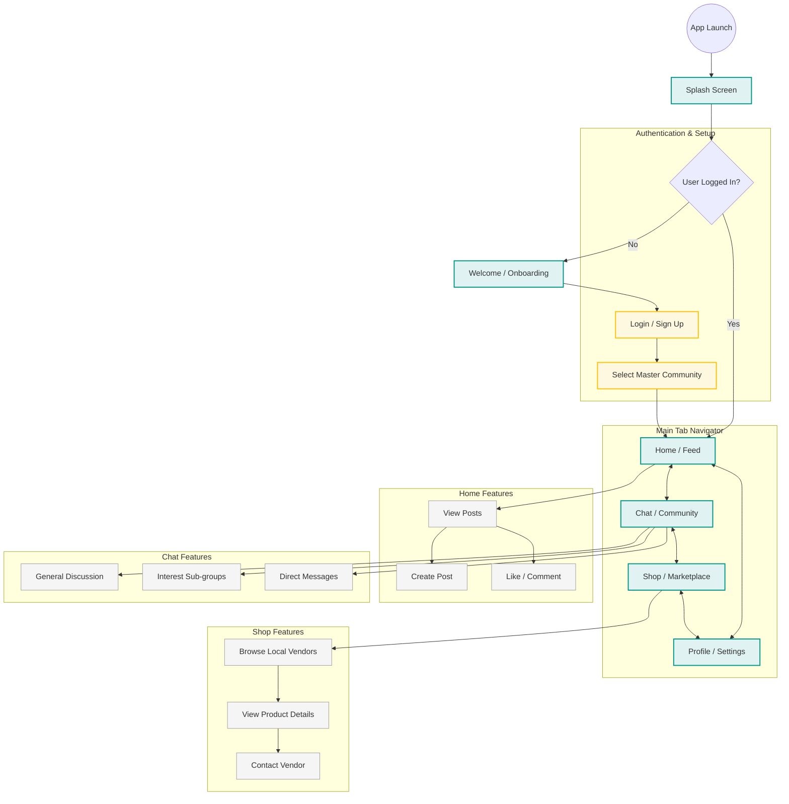

# Master Connect - App Flow Diagram

This diagram outlines the user flow for the **Master Connect** application, covering both implemented features and planned modules based on the project documentation.

## Flow Description

1.  **Onboarding**: New users are greeted with a value proposition (Community, Chat, Shop) before proceeding to setup.
2.  **Setup**: Users identify their "Master Community" (Location/Group) to ensure content relevance.
3.  **Home (Feed)**: The central hub for community updates, news, and social interaction.
4.  **Chat**: Real-time communication channels for the community and specific interest groups.
5.  **Shop**: A marketplace for local vendors to list products and for users to discover local businesses.
